# QuizApp

This project was generated with [Angular CLI](https://github.com/angular/angular-cli) version 13.2.6.

## About

This application is created using Angular, Angular Material, TypeScript, SCSS and HTML. To get technical questions I used a HTTP REST API `Quiz Api`.

This project uses reusable UI components from Angular Material like toolbar, dialog, input, slider and more.

Reactive forms are used to handle checkboxes with answers, comments and search bar. User input for comments is validated and display useful validation messages.

Navigation was made with Angular Routing. Application can be used on different media types/devices because of media queries.

Unit tests are created with Jasmine and Karma.

## Taking a quiz

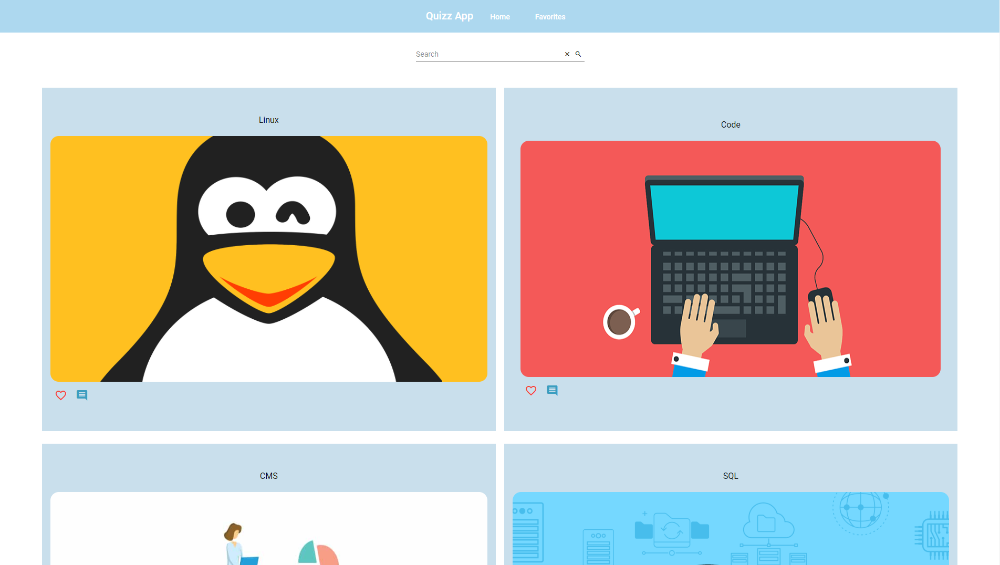

In the app user can choose from 7 quiz categories - Linux, Code, CMS, SQL, Docker, DevOps and Random, which consists of random questions from each category. Quizes have three levels of difficulty - easy, medium and hard. User can also choose the amount of questions. Difficulty and amount of questions can be select from a range by moving the slider thumb.

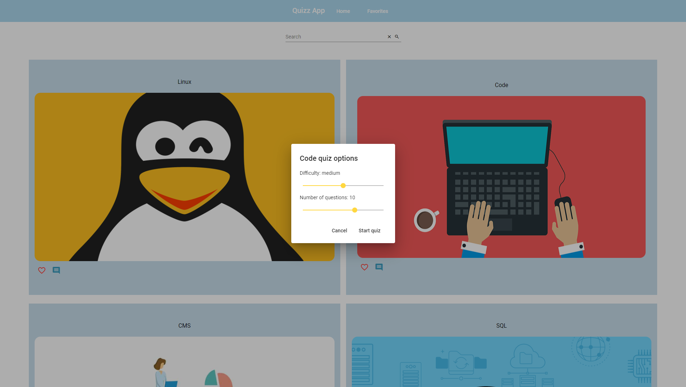

During the quiz you can choose more than one answer. Buttons `Next` and `Previous` allows you to navigate through the quiz.

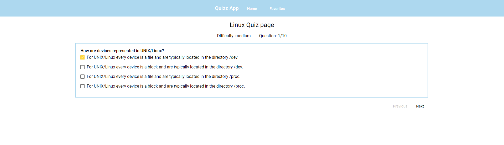

When your answers are submitted, you will see the quiz result page with your score. If your answer is correct, it will be decorated with a light green color. If not, your answer will be red and the correct one will have a light green color. As a result it is a great opportunity to learn and compare your results with correct answers.

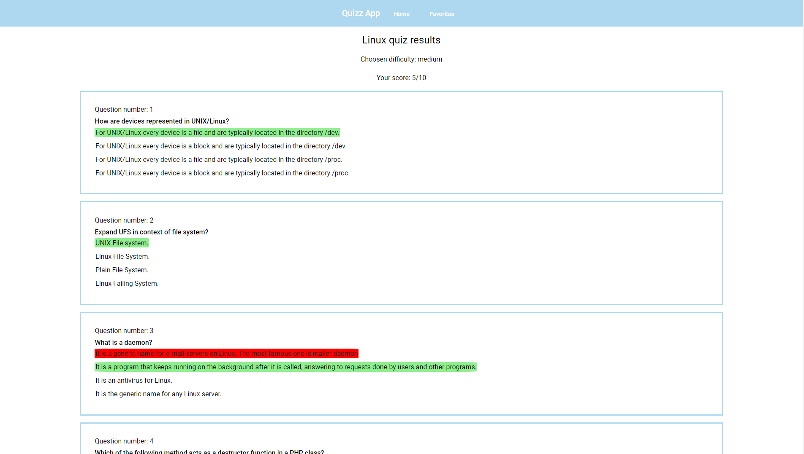

## Favorite quizes

You can move your favorite quizes to the `Favorites` tab by clicking on a heart under the quiz. To remove a quiz from favorites, just click it again.

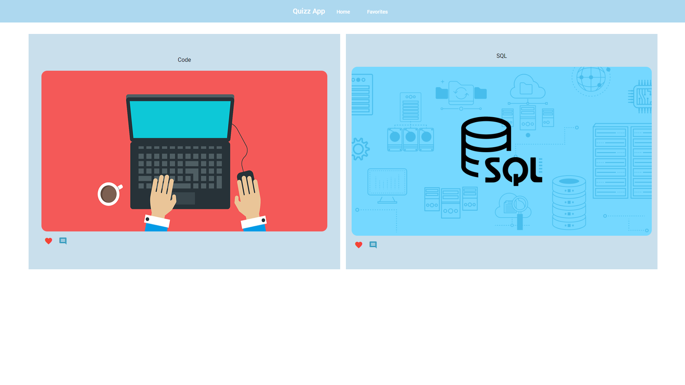

## Comments

To add a comment to the quiz, click on the comment icon below the quiz.

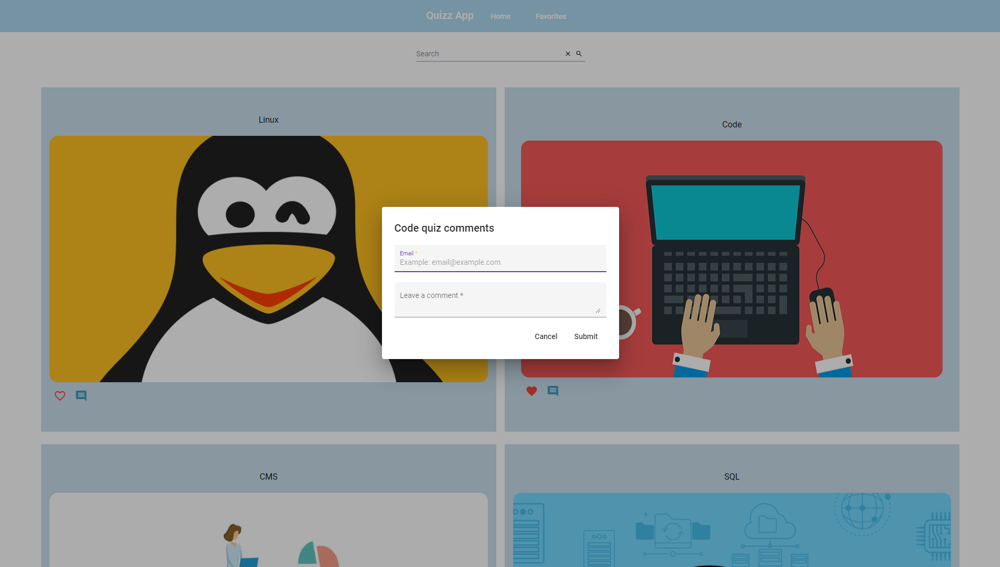

Validators will not allow any empty input - both email and comment is required.

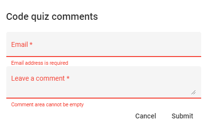

Email address must be valid and contain `@` character.

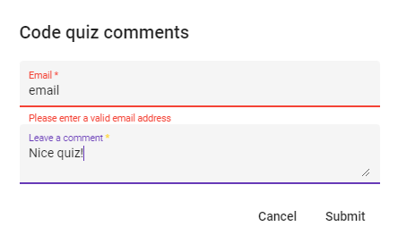

Successfully added comment will be added below the inputs.

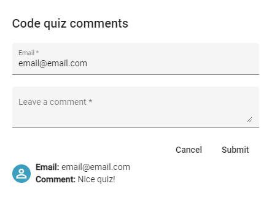

## Search bar

Search bar allows to search through the quizes by typing a part of the quiz category name.

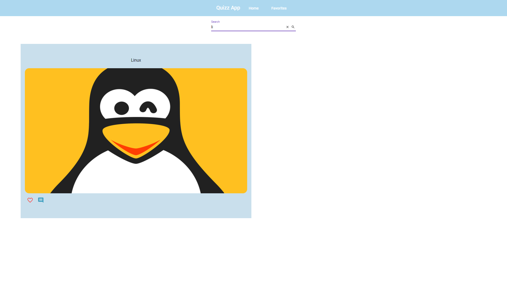

## Mobile devices

App can be run on mobile devices.

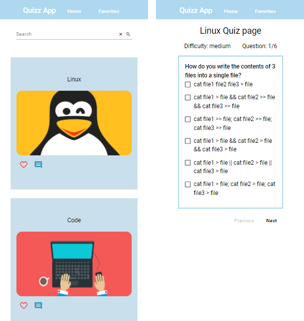
